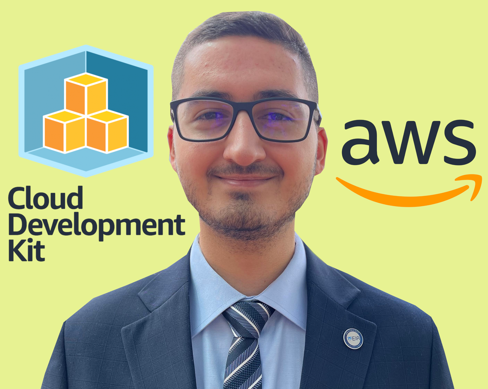

# :dizzy: AWS CDK ATHENA S3 WORKFLOW :dizzy:

  

This is a fun Athena-based project deployed on AWS with Infrastructure as Code on top of [AWS CDK (TypeScript)](https://aws.amazon.com/cdk/). The overall functionality of the project is to be able to deploy (and automatically configure) the AWS Glue and Athena services (Workgroup, Database, Table and Queries), so that some "Raw Data" (found at [`cdk/sample_data`](cdk/sample_data/)) that is stored in an Raw Data S3 bucket, can be queried with Athena-Named-Queries in an SQL-like approach, and the results are automatically stored in another "Results" bucket. It also deploys a sample role that can be used by the Glue service in Crawlers.  

The information of this repository is based on many online resources, so feel free to use it as a guide for your future projects!  

## AWS CDK :cloud:

[AWS Cloud Development Kit](https://aws.amazon.com/cdk/) is an amazing open-source software development framework to programmatically define cloud-based applications with familiar languages.  

My personal opinion is that you should learn about CDK when you feel comfortable with cloud-based solutions with IaC on top of [AWS Cloudformation](https://aws.amazon.com/cloudformation/). At that moment, I suggest that if you need to enhance your architectures, it's a good moment to use these CDK-based solutions.  

The best way to start is from the [Official AWS Cloud Development Kit (AWS CDK) v2 Documentation](https://docs.aws.amazon.com/cdk/v2/guide/home.html).  

## Dependencies :vertical_traffic_light:

### Software dependencies (based on project)

- [Visual Studio Code](https://code.visualstudio.com/)  
  Visual Studio Code is my main code editor for high-level programming. This is not absolutely necessary, but from my experience, it gives us a great performance and we can link it with Git and GitHub easily.  

- [NodeJs](https://nodejs.org/en/)  
  NodeJs is a JavaScript runtime built on Chrome's V8 JavaScript engine programming language. The community is amazing and lets us handle async functionalities in elegant ways.  

### Libraries and Package dependencies (based on project)

- [CDK CLI (Toolkit)](https://docs.aws.amazon.com/cdk/v2/guide/cli.html)  
  To work with the CDK, it is important to install the main toolkit as a NodeJs global dependency. Please refer to the official AWS [Getting started with the AWS CDK](https://docs.aws.amazon.com/cdk/v2/guide/getting_started.html) 

## Usage :dizzy:

Project deployment commands are explained in detail at [`important_commands.sh`](important_commands.sh), including the necessary steps to configure CDK and do the deployments.  

## Special thanks :gift:

- Thanks to all contributors of the great OpenSource projects that I am using.  

## Author :musical_keyboard:

### Santiago Garcia Arango

<table border="1">
    <tr>
        <td>
            
Senior DevOps Engineer passionate about advanced cloud-based solutions and deployments in AWS. I am convinced that today's greatest challenges must be solved by people that love what they do.

        </td>
        <td>
            

        </td>
    </tr>
</table>
